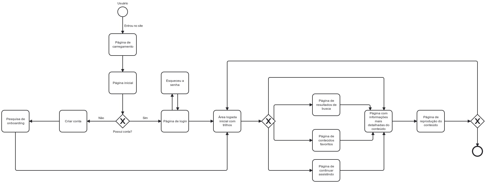

# Projeto de Interface

Pré-requisitos: <a href="2-Especificação do Projeto.md"> Documentação de Especificação</a>

Visão geral da interação do usuário pelas telas do sistema e protótipo interativo das telas com as funcionalidades que fazem parte do sistema (wireframes).

## Fluxograma

Fluxo de usuário (User Flow ou Fluxograma) é uma técnica que permite ao desenvolvedor mapear todo fluxo de telas do site ou app. Essa técnica funciona para alinhar os caminhos e as possíveis ações que o usuário pode fazer junto com os membros de sua equipe. Em nosso modelo, na notação BPMN, temos um fluxo em que o usuário inicia sua interação ao entrar no site, passando por páginas a depender de suas preferências.

## Wireframes

### Tela - Home-Page (Index)

A página de homepage homepage apresenta uma seleção de conteúdo atraente para o usuário, com destaque para os mais populares ou recomendados. Será também nessa página em que o serviço será apresentado ao usuário visitante, servindo como uma página de "lead". A página deve conter um botão de inscrição para incentivar os usuários a explorarem o conteúdo e se cadastrarem no site.

Imagem em falta.

### Tela - Carregamento 

Essa tela é responsável por apresentar o período de carregamento do site.

### Tela - Criar Conta

Página de criação de conta, a qual será criado uma conta para o usuário. Serão necessárias algumas informações para que a conta seja criada, como nome de usuário, e-mail, senha, data de nascimento.

### Tela - Pesquisa de Onboarding

Essa tela é responsável para que o usuário seja recomendado com conteúdos adequados referentes ao seu nível de conhecimento atual. Serão aplicados perguntas, como familiaridade com ferramentas, tempo de experiência, e a partir disso, definir o nível do usuário.

### Tela - Login

A tela de login é responsável para que o usuário acesse à sua conta.

### Tela - Esqueceu a senha

Se o usuário já tiver feito o cadastro mas tiver esquecido a senha será possível recuperar a mesma por um e-mail que lhe será enviado.

### Tela - Área logada com trilhos

Após o usuário entrar no sistema, ele será redirecionado para esse página. Serão exibidos horizontalmente os trilhos navegáveis de conteúdos, sendo exibido uma barra lateral estática navegável por click para acessar páginas de Busca, Favoritos, Continuar Assistindo e Perfil.

### Tela - Resultados de busca

Tela que apresentará os resultados de busca realizada pelo usuário.

Imagem em falta.

### Tela - Conteúdos favoritos

Tela que apresentará os conteúdos adicionados aos favoritos pelo usuário.

### Tela - Continuar assistindo

Tela que exibirá os conteúdos que estão sendo assistidos pelo usuário naquele momento.

Imagem em falta.

### Tela - Informações detalhadas do conteúdo

Essa tela exibirá informações detalhadas sobre o conteúdo em que foi clicado, contendo informações como autor, um breve introdução e ao que se refere aquele conteúdo.

### Tela - Reprodução do conteúdo

Nessa tela o conteúdo escolhiod pelo usuário será exibido.

